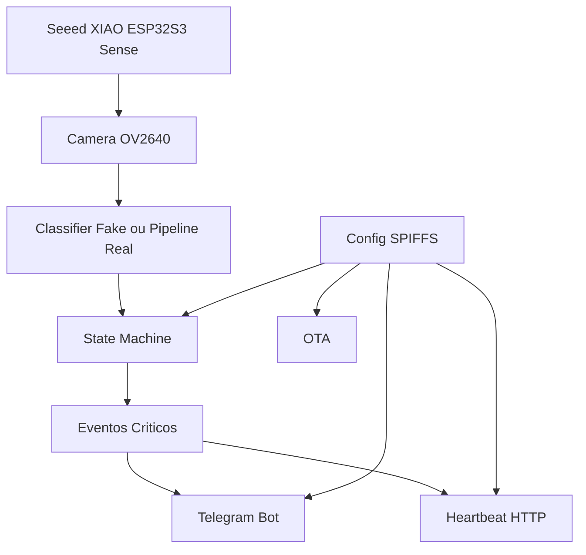

# Sistema de monitoramento assistivo para idosos usando Edge AI e TinyML em ESP32-S3 Sense TESTE

Aviso: Este projeto e um prototipo tecnologico/open source para estudo e experimentacao. Nao e um dispositivo medico certificado e nao deve ser utilizado como unico meio de monitoramento de saude ou seguranca.

## Visao Geral

ElderGuard Edge AI e um sistema de monitoramento baseado em visao computacional e TinyML para reconhecer estados relacionados ao uso da cama e detectar eventos como queda, tentativa de levantar e imobilidade prolongada.

Estados visuais monitorados:

- lying
- sitting
- standing
- on_floor
- empty_bed

Eventos inferidos pela maquina de estados (firmware):

- Possivel queda detectada
- Pessoa imovel no chao por tempo prolongado
- Tentativa de levantar
- Pessoa fora da cama por periodo incomum

## Status Atual da Implementacao

O firmware foi estruturado para dois modos de classificacao:

- Modo fake (padrao): usado para testes de rotina sem depender de pipeline TinyML completo.
- Modo real: ponto de entrada preparado para usar modelo embutido em `model.tflite.h`.

O projeto tambem possui:

- Configuracao persistente em SPIFFS (`/config.json`)
- Camera wrapper robusto para Seeed XIAO ESP32S3 Sense (OV2640)
- Heartbeat HTTP (uptime/rssi/version)
- OTA via HTTPUpdate
- Alerta Telegram com mensagem e envio binario de JPEG

## Arquitetura (resumo)



## Hardware

- Microcontrolador: Seeed Studio XIAO ESP32S3 Sense
- Camera: OV2640 integrada
- Conectividade: Wi-Fi 802.11 b/g/n
- Alimentacao: USB-C 5V ou bateria externa

## Firmware

Desenvolvido com Arduino Framework (PlatformIO).

Bibliotecas principais:

- `WiFi.h`
- `esp_camera.h`
- `UniversalTelegramBot.h`
- `ArduinoJson.h`
- `HTTPUpdate.h` (OTA)
- `SPIFFS.h`

Funcionalidades implementadas:

- Conexao Wi-Fi automatica com watchdog de reconexao
- Captura com troca dinamica de resolucao (inferencia/foto)
- Maquina de estados com historico e regras temporais
- Alertas Telegram com retry
- Heartbeat periodico
- OTA periodico
- Configuracao persistente em SPIFFS

## Fake x Real: como alternar o classificador

Edite `firmware/src/config.h`:

1. Modo teste (padrao)

```cpp
#define USE_FAKE_CLASSIFIER 1
// #define USE_REAL_INFERENCE_PIPELINE 1
```

2. Modo inferencia real (modelo embutido)

```cpp
// #define USE_FAKE_CLASSIFIER 1
#define USE_REAL_INFERENCE_PIPELINE 1
```

Observacao: no modo real, o ponto de entrada esta preparado e o proximo passo e ligar preprocessamento + interpreter TensorFlow Lite Micro + pos-processamento para mapear saida em `VisualState`.

## Configuracao persistente (SPIFFS)

O firmware usa `firmware/src/config_store.*` para manter configuracoes em `/config.json`.

Campos persistidos:

- `wifi_ssid`
- `wifi_password`
- `bot_token`
- `chat_id`
- `heartbeat_url`
- `ota_url`

Fluxo:

- No boot, tenta carregar do SPIFFS.
- Se arquivo nao existir ou estiver invalido, grava defaults definidos em `config.h`.

## Configuracao da camera (XIAO ESP32S3 Sense)

O wrapper em `firmware/src/camera_wrapper.cpp` esta com:

- Pinagem explicita da placa
- Configuracao de `camera_config_t` completa
- Ajustes basicos de sensor
- Retry de captura para reduzir falhas intermitentes

Se houver variacao de revisao de hardware, ajuste os pinos no proprio arquivo.

## Configuracao do Telegram

1. Crie um bot via `@BotFather`.
2. Obtenha seu `chat_id` (ex.: `@userinfobot`).
3. Configure os valores padrao em `firmware/src/config.h` ou atualize `/config.json` em SPIFFS.

## Monitoramento (Heartbeat)

A cada intervalo definido, o firmware envia GET para a URL configurada com:

- `uptime`
- `rssi`
- `version`

## Instalacao e Uso (PlatformIO)

```bash
git clone https://github.com/seu-usuario/elderguard-edge-ai.git
cd elderguard-edge-ai/firmware
platformio run
platformio run --target upload
```

Monitor serial:

```bash
platformio device monitor -b 115200
```

## Estrutura do Repositorio (resumo atual)

```text
ElderGuard-Edge-AI/
├── README.md
├── docs/
├── firmware/
│   ├── platformio.ini
│   └── src/
│       ├── main.cpp
│       ├── config.h
│       ├── config_store.h
│       ├── config_store.cpp
│       ├── wifi_manager.h
│       ├── wifi_manager.cpp
│       ├── camera_wrapper.h
│       ├── camera_wrapper.cpp
│       ├── classifier.h
│       ├── classifier.cpp
│       ├── state_machine.h
│       ├── state_machine.cpp
│       ├── telegram_notifier.h
│       ├── telegram_notifier.cpp
│       ├── heartbeat.h
│       ├── heartbeat.cpp
│       ├── ota_update.h
│       ├── ota_update.cpp
│       └── model.tflite.h
└── tools/
```

## Interoperabilidade e evolucoes futuras

O firmware ja expoe gancho para eventos externos:

- `onExternalEvent(const String& eventType, float confidence)`

Possiveis integracoes:

- Radar mmWave
- Wearables
- Botao SOS
- Home Assistant (webhook)

## Contribuicao

Contribuicoes sao bem-vindas via issues e pull requests.

## Licenca

Este projeto e licenciado sob MIT. Veja o arquivo `LICENSE` para detalhes.